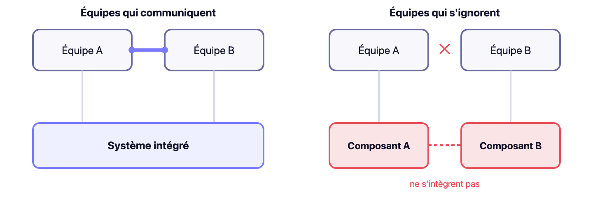
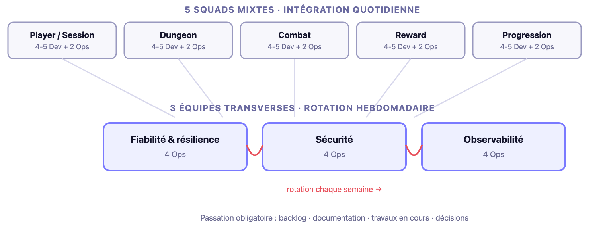

<!-- _class: title -->

# Platform Engineering

## Séance d'ouverture · M2 Ops

<!--
Déjà court. Pas de retouche.
-->

---

## Le point de départ

- Vous allez construire un produit. Ses utilisateurs sont dans la salle d'à côté.
- Ne partez pas de l'organisation. Partez de ce qu'ils construisent.

---

## $ ~ whoami
### Luc Chmielowski

- Platform Engineer, actuellement @ Leetchi
- Mainteneur open-source @ CNCF
- Au delà de vous apprendre kubernetes, je serai celui qui vous demande **pourquoi**.

 

> En tant que platform engineer je construis des plateformes infra pour des devs, ce cours vient donc de ce que j'ai appris à leurs dépens.

---

<!-- _class: section -->

01

# Contexte

Le projet, et pour qui vous le construisez

---

Contexte

## Vos clients, les développeurs

- Les équipes dev ne sont pas (seulement) vos camarades de promo, **ce sont vos utilisateurs**, 
- Un seul critère : est-ce que ça les fait avancer plus vite avec moins de charge cognitive ?
- Une plateforme classique a un droit de passage. Vous ne l'avez pas.

<!--
Elles ont des délais, elles doivent livrer. Une équipe plateforme construit quelque chose que personne n'est obligé d'utiliser. Utiliser un droit de passage revient à un échec de conception. Phrase centrale de la séance, tout le reste en découle.
-->

---

<!-- _class: section -->

02

# Attentes

Ce qu'on attend de vous, et comment c'est évalué

---

Attentes

## Conception complète, aucune techno imposée

- Vous choisissez, vous mettez en œuvre, vous défendez.

<!--
Une contrainte technique s'y ajoute, on y revient à la fin de cette section.
-->

---

Attentes

## L'IA est autorisée, et évaluée

- Autorisée partout, sur tout.
- Toute production assistée doit être expliquée, testée, contestée, modifiée par son auteur, en direct, sans préparation.

<!--
La compétence mesurée est la supervision et la décision, pas la capacité à obtenir un artefact plausible.
-->

---

Attentes

## Deux transferts, deux natures

| | Dev → Ops | Ops → Dev |
|---|---|---|
| Sujet | Architecture distribuée | Utiliser votre plateforme |
| Objectif | Comprendre | Autonomie |
| Vous n'avez pas à | Savoir l'implémenter | Leur apprendre à opérer un cluster |
| Preuve | Vous challengez avant que ça devienne votre incident | Un dev déploie et diagnostique sans vous |

<!--
Ils sont vos utilisateurs, pas vos successeurs.
-->

---

Attentes

## Ce que vous transmettez

| Bloc | Le dev doit savoir |
|---|---|
| Runtime | Déployer, savoir si c'est parti, comprendre un pod qui ne démarre pas |
| Livraison | Commit → prod, promotion, retour arrière |
| Observabilité : usage | Logs, trace, réagir à une alerte |
| Observabilité : code | Contrat d'instrumentation |
| Frontières | Ce qu'il fait seul / ce qui passe par vous / sortie de secours |

<!--
Le périmètre de ce transfert = périmètre de votre chemin de déploiement. Hors périmètre : installation du cluster, topologie, réseau, stockage, tenancy, quotas.
-->

---

Attentes

## Trois points de méthode sur les transferts

- 1. Transmettre n'est pas relayer
- 2. C'est un flux, pas une séance
- 3. Un transfert difficile à écrire signale un chemin trop complexe

<!--
1. Envoyer un lien vers le dépôt n'est pas un transfert, le matériel doit être le vôtre.
2. Ça grandit avec votre plateforme, vous ne transmettez pas ce que vous n'avez pas encore choisi.
3. Si le transfert est dur à écrire, votre chemin est trop complexe, c'est un signal de conception.
Les deux transferts ont une date, un format, un livrable, décidés entre vous et les équipes dev.
-->

---

Attentes

## Les jalons, indicatifs

  

    
S2

    
Premier déploiement

    
En production

  

  

    
S4

    
Chaîne de livraison

  

  

    
S6

    
Exploitation

  

  

    
S8

    
Validation finale

  

<!--
Répondent à une seule question : êtes-vous en retard ou non ? Rien ne démarre avant que le cluster existe : le socle est votre chemin critique. S2 n'est pas indicatif comme les autres : 22 développeurs attendent derrière. Indicatif ne veut pas dire sans conséquence.
-->

---

Attentes

## Défendre, pas justifier

  

    <h4>Direction</h4>
    
Tenir sous contradiction, ne pas juste prouver qu'on avait raison.

  

  

    <h4>Moment</h4>
    
Au moment de la décision, pas après coup, en connaissant déjà le résultat.

  

  

    <h4>Alternatives</h4>
    
Savoir pourquoi elles ne convenaient pas ICI, pas juste les mentionner.

  

  

    <h4>Limites</h4>
    
Connaître la condition d'invalidité, pas les minimiser.

  

<!--
Une décision dont on ne peut pas énoncer les conditions d'invalidité n'a pas été prise. Elle a été subie.
-->

---

Attentes

## Les ADR

- Au moment de la décision = défense / Après coup = justification.

  

    <h4>Contexte</h4>
    
La situation qui force la décision, pourquoi maintenant, pourquoi ce choix devient nécessaire.

  

  

    <h4>Décision</h4>
    
Ce qui est tranché, en une phrase claire.

  

  

    <h4>Alternatives écartées</h4>
    
Et pourquoi elles ne convenaient pas ICI, dans votre contexte, pas dans l'absolu.

  

  

    <h4>Signal de révision</h4>
    
Ce qui vous ferait changer d'avis, observable, pas une bonne intention.

  

<!--
Format complet dans EXIGENCES.md.
-->

---

Attentes

## Exemple d'ADR

  

    <h4>Contexte</h4>
    
Deux services demandent un accès direct à la même base pour éviter une duplication de données.

  

  

    <h4>Décision</h4>
    
Chaque service garde sa propre base. La duplication contrôlée remplace l'accès direct.

  

  

    <h4>Alternatives écartées</h4>
    
Base partagée : plus simple à court terme, mais interdit toute restauration ciblée. Rejetée pour ce système, pas dans l'absolu.

  

  

    <h4>Signal de révision</h4>
    
Si la duplication cause une dérive de données que la réconciliation ne résout plus, la décision est rouverte.

  

<!--
Cet exemple reprend directement la contrainte « pas de base partagée entre services » et le concept de réconciliation du Pilier 1 : un ADR n'invente pas un nouveau vocabulaire, il applique les concepts déjà posés à une décision concrète.
-->

---

Attentes

## La consultation : RFC et review d'ADR

- 1. Une question précise (pas « qu'en pensez-vous », « avons-nous raté un scénario d'échec »)
- 2. Une date de clôture
- 3. Un résumé des retours par l'auteur

<!--
Une RFC = décision non prise, soumise à feedback. Une review d'ADR = décision presque prise, soumise à vérification. Un retour ignoré sans explication dit « vos avis ne comptent pas ». Une RFC dont les retours ne sont jamais résumés est une boîte aux lettres.
-->

---

Attentes

## Trois exemples de questions de défense

- 1. Quelle dimension d'isolation n'assurez-vous pas, quel scénario en profiterait ?
- 2. Est-ce que votre plateforme accélère ou impose ? Quelle preuve en avez vous ?
- 3. Dans quelles conditions cette décision devient-elle mauvaise ?

<!--
Aucune n'a de réponse générique, seulement si vous connaissez votre système.
-->

---

Attentes

## Ce qui sera évalué

- 1. Test du chemin de déploiement, chronométré, sans aide
- 2. Incidents injectés, détection, qualification, décision, restauration, post-mortem
- 3. Interrogations individuelles, point nommé, contrainte qui change en direct

<!--
L'évaluation porte sur les décisions et leur défense, pas sur la présence d'une implémentation.
-->

---

Attentes

## Communiquer techniquement

  

    <h4>Partager</h4>
    
<strong>Post-mortem, runbook.</strong> Après un apprentissage, ce que quelqu'un devra relire plus tard.

  

  

    <h4>Consulter</h4>
    
<strong>RFC, review d'ADR.</strong> Avant de décider, vérifier qu'on n'a rien raté.

  

  

    <h4>Décider</h4>
    
<strong>ADR.</strong> Après avoir tranché, trace de la décision.

  

<!--
La plupart des désaccords qui dégénèrent viennent d'une décision bien prise, mal communiquée. La review croisée : avant de figer un ADR, une personne extérieure pose une seule question : « quelle est la condition qui vous ferait changer d'avis ? » Pas pour bloquer, pour révéler ce qui n'a pas été pensé.
-->

---

Attentes

## Quand écrire

  

    
1Décision difficile à annuler ?

    
2Engage plusieurs équipes ?

    
3Pertinente dans 6 semaines ?

    
4Quelqu'un devra la comprendre sans vous ?

  

  

    

      
0 à 1 oui

      
Discussion orale, décision notée dans le fil du canal

    

    

      
2 oui ou plus

      
ADR ou RFC

    

  

<!--
Écrire trop tue la lecture. Si tout est important, rien ne l'est.
-->

---

Attentes

## Kubernetes on-premise : la seule contrainte

- Élasticité illimitée → somme fixe
- Répartiteur / stockage / identité auto-fournis → à construire
- Deux équipes, même capacité demandée : qui décide, sur quel critère ?

<!--
Le on-prem n'est pas une punition : c'est la partie la plus proche du métier réel. En infra louée, « ça ne tient pas la charge » a une réponse paresseuse : payer. Ici cette réponse n'existe pas. Vous serez obligés d'arbitrer explicitement, par écrit. Cette contrainte cadre tout ce qui vient : chemin goudronné, charge finie, arbitrage. La partie théorie qui suit en découle directement.
-->

---

Attentes

## Kubernetes : contrainte et outil

- La contrainte devient la méthode : c'est aussi comment vous ferez respecter les cinq piliers.

  

    <h4>Réconciliation continue</h4>
    
Vous déclarez l'état voulu, Kubernetes le fait respecter en continu, pas seulement au moment du déploiement.

  

  

    <h4>Runtime commun aux Dev et Ops</h4>
    
Pas une couche que vous cachez : les Dev déploient directement dessus, le vocabulaire (pod, service, namespace) est partagé.

  

<!--
La réconciliation continue est le mécanisme central : un contrôleur compare en boucle l'état réel à l'état déclaré et corrige les écarts. C'est ce qui vous permettra d'exprimer et de faire tenir les contraintes de chaque pilier sans intervention manuelle à chaque fois. Les Dev ne verront pas Kubernetes à travers une abstraction complète : c'est leur outil aussi, pas seulement le vôtre.
-->

---

<!-- _class: section -->

03

# Platform Engineering

D'où ça vient, pourquoi ça existe

---

Platform Engineering

## Trois âges

  

    
Ops

    
Quelqu'un tient la prod

    
Résolu : continuité de service Créé : mur build/run

  

  

    
DevOps

    
Le mur tombe

    
Résolu : propriété de la prod Créé : chaque équipe doit tout savoir

  

  

    
Platform

    
Mutualiser sans reconstruire le mur

    
Résolu : duplication de charge Créé : une plateforme que personne n'utilise

  

<!--
Pas un retour aux Ops. La différence tient en un mot : vous n'avez pas de droit de passage.
-->

---

Platform Engineering

## Le changement de mindset : produit, pas service interne

- DevOps : chaque équipe possède son infra, « you build it, you run it ».
- Platform Engineering : une équipe construit un produit, les autres équipes sont ses clients.

  

    <h4>Roadmap</h4>
    
Pilotée par le besoin des utilisateurs, pas une liste de tickets à traiter.

  

  

    <h4>Utilisateurs, pas tickets</h4>
    
Vous parlez à vos consommateurs pour comprendre leur usage, pas seulement pour répondre à leurs demandes.

  

  

    <h4>Itération sur feedback</h4>
    
Le produit évolue selon ce qui est réellement utilisé, pas selon ce qui semble complet.

  

  

    <h4>Adoption, pas obligation</h4>
    
Un produit se mesure à son taux d'adoption volontaire, personne n'est forcé de l'utiliser.

  

<!--
Ce basculement vers l'état d'esprit produit est reconnu comme le principe central du platform engineering (Humanitec, CNCF Platforms White Paper) : traiter votre plateforme interne comme un produit, et les équipes de développement comme vos clients, pas comme des utilisateurs captifs d'un service imposé. Ça change ce que vous priorisez et comment vous mesurez le succès. Ça rejoint directement la slide « Vos clients, les développeurs » : une plateforme classique a un droit de passage, vous ne l'avez pas, parce que vous êtes un produit, pas une autorité.
-->

---

Platform Engineering

## Pourquoi le DevOps casse à l'échelle

- Fonctionne à 8 équipes. Casse à 40.

  

    <h4>Pipelines</h4>
    
7 manières différentes de déployer. Aucune mutualisation.

  

  

    <h4>Observabilité</h4>
    
Chaque équipe reconstruit sa propre pile de logs, métriques, traces.

  

  

    <h4>Secrets</h4>
    
Gestion et rotation réinventées équipe par équipe.

  

<!--
"You build it, you run it" : chaque équipe reconstruit son pipeline, sa pile d'observabilité, sa gestion de secrets. Des équipes produit qui passent la moitié de leur temps sur de l'infra. Le platform engineering répond à ce coût de duplication.
-->

---

Platform Engineering

## Pourquoi une plateforme existe

- Charge finie. 7 responsabilités ≠ 7 domaines maîtrisés.

  

    <h4>Domaine métier</h4>
    
Ce pour quoi l'équipe existe, la seule chose qu'elle devrait avoir à maîtriser.

  

  

    <h4>Infrastructure</h4>
    
Base de données, pipeline de build, réseau : trois domaines techniques en plus.

  

  

    <h4>Exploitation</h4>
    
Secrets, alerting : la production qu'il faut aussi tenir.

  

- Une plateforme retire de la charge, ne la déplace pas, ne l'ajoute pas.

<!--
Pourquoi une organisation paie des gens à ne pas livrer de fonctionnalité client ? Une équipe produit a une capacité de raisonnement finie : domaine métier, base, pipeline, réseau, secrets, build, alerting. Tenir les sept, c'est n'en tenir aucun bien.
-->

---

Platform Engineering

## « Avec l'IA, chacun code ce dont il a besoin »

- Générer un pipeline sur mesure prend une heure. Le faire tourner trois ans, non.

  

    <h4>Ce que l'IA accélère</h4>
    
Écrire : pipeline, dashboard, scaffolding d'API. Le temps de construction s'effondre.

  

  

    <h4>Ce qu'elle ne retire pas</h4>
    
Tenir en prod : patch de sécurité, dérive de configuration, l'incident à 3h sur un outil que personne d'autre ne comprend.

  

  

    <h4>Ce qu'elle aggrave</h4>
    
Chaque équipe génère sa propre variante. La duplication du slide précédent, produite plus vite, par des équipes qui ne se parlent pas plus qu'avant.

  

- La plateforme n'est plus en concurrence avec « je le code moi-même ». Elle décide quelle part de ce que l'IA génère devient un chemin partagé, plutôt qu'un artefact que son auteur est seul à savoir faire tourner.

<!--
L'objection mérite d'être prise au sérieux, pas balayée. Elle a raison sur un point : le coût de construction s'effondre. Elle a tort de s'arrêter là. La loi de Conway (slide « La loi de Conway ») ne se négocie pas avec un modèle de langage : des équipes qui ne se parlent pas produisent N variantes du même pipeline, pas une intégration. Et la charge cognitive qui suit ne disparaît pas parce que le code a été généré au lieu d'être tapé à la main — elle se déplace vers celui qui doit comprendre, trois ans plus tard, ce qu'un modèle a produit sans jamais expliciter pourquoi.
-->

---

Platform Engineering

## Charge cognitive et Thinnest Viable Platform

- Le vocabulaire du platform engineering vient d'un seul livre : Team Topologies (Skelton &amp; Pais, 2019).

  

    <h4>Charge cognitive</h4>
    
La charge mentale qu'un dev doit porter pour faire son travail. Domaine métier, mais aussi tout ce que personne d'autre ne prend en charge.

  

  

    <h4>Thinnest Viable Platform</h4>
    
Pas la plateforme la plus complète possible. La plus fine qui réduit vraiment la charge, rien de plus.

  

  

    <h4>Le risque inverse</h4>
    
Une plateforme trop épaisse devient elle-même une charge cognitive supplémentaire, voir le test hebdomadaire qui suit.

  

  

    <h4>Où ça s'applique</h4>
    
Le chemin goudronné, plus loin dans cette séance, est une application directe du TVP.

  

<!--
Cognitive load et Thinnest Viable Platform sont les deux termes centraux de Team Topologies (Skelton & Pais) pour décrire ce que le platform engineering essaie de faire. Vous les recroiserez partout dans la vraie littérature du domaine : PlatformCon, CNCF Platforms White Paper. Autant les avoir maintenant plutôt que de redécouvrir le vocabulaire plus tard pour un concept déjà connu.
-->

---

Platform Engineering

## Team Topologies

  

    <h4>Stream-aligned</h4>
    
Responsable d'un produit ou d'un service, de bout en bout.

  

  

    <h4>Platform</h4>
    
Réduit la charge cognitive des autres équipes en leur fournissant du self-service.

  

  

    <h4>Enabling</h4>
    
Une équipe temporaire d'experts qui monte les autres en compétence, puis se retire.

  

  

    <h4>Complicated-subsystem</h4>
    
Possède une brique trop complexe ou trop spécialisée pour être partagée.

  

<!--
Quatre types d'équipe qui couvrent la quasi-totalité des organisations tech réelles. Une équipe sécurité ou data qui vient former les autres puis repart : enabling. Une équipe qui possède un moteur de pricing ou un système de paiement trop complexe pour être partagé : complicated-subsystem. Les connaître maintenant évite de redécouvrir le vocabulaire au premier jour d'un vrai poste.
-->

---

Platform Engineering

## Le test hebdomadaire

- Chaque semaine, une question : ce que vous avez livré a-t-il vraiment retiré de la charge, ou juste changé de forme ?

  

    <h4>Un gabarit copié sans vous</h4>
    
L'équipe l'adapte seule, sans repasser par vous.

    Charge retirée
  

  

    <h4>Une abstraction à comprendre en plus</h4>
    
Elle s'ajoute à ce qu'elle était censée cacher.

    Charge ajoutée
  

  

    <h4>Un formulaire qui déclenche une action manuelle</h4>
    
Quelqu'un doit encore traiter la demande.

    Charge déplacée, délai ajouté
  

  

    <h4>Une doc de 40 pages sur votre outil maison</h4>
    
Présentée comme un service, elle en est un de plus à maintenir.

    Charge ajoutée, déguisée
  

<!--
La troisième ligne est la plus fréquente et la plus difficile à voir de l'intérieur : ça ressemble à du service, tout le monde est poli, et pourtant chaque déploiement attend quelqu'un.
-->

---

<!-- _class: section -->

04

# Concevoir

Comment construire un chemin qu'on choisit d'emprunter

---

Concevoir

## Le chemin goudronné

- Le trajet le plus facile pour faire ce que 80 % des équipes font 80 % du temps.

  

    <h4>Optionnel</h4>
    
Sinon, c'est un mur.

  

  

    <h4>Plus rapide que l'alternative</h4>
    
Sinon, personne ne le prend.

  

  

    <h4>Sortie documentée</h4>
    
Sinon, les sorties se font en douce.

  

- Couvre le cas majoritaire, pas tous les cas.

<!--
Les trois propriétés sont nécessaires ensemble : retirer une seule suffit à tout casser.
-->

---

Concevoir

## Trois modes d'interaction

  

    <h4>Self-service</h4>
    
L'équipe consomme sans vous parler. État cible : l'interaction minimale n'est pas un manque de service, c'est le signe que ça marche.

  

  

    <h4>Collaboration</h4>
    
Vous résolvez ensemble un problème encore mal défini. Doit avoir une date de fin, sinon elle devient confortable et remplace l'abstraction qu'elle devrait produire.

  

  

    <h4>Accompagnement</h4>
    
Vous rendez l'équipe autonome sans prendre le sujet à votre charge. C'est le mode du transfert Kubernetes vers les Dev.

  

<!--
Erreur classique : rester en collaboration permanente parce que c'est gratifiant, et ne jamais produire l'abstraction qui la rendrait inutile.
-->

---

Concevoir

## Le contournement est votre meilleur indicateur

- Un contournement signale un chemin officiel trop lent.
- Pas du platform engineering : outils sans plateforme, guichet de tickets, décider seuls, plateforme parfaite sur produit cassé.

<!--
Un contournement reproché ne sera plus signalé : vous perdez votre meilleur capteur.
-->

---

<!-- _class: section -->

05

# Votre organisation

Comment vous êtes structurés

---

Votre organisation

## La loi de Conway

- Une architecture copie sa structure de communication.

<!--
Deux sous-groupes qui ne se parlent pas produisent deux composants qui ne s'intègrent pas. C'est le principe qui a guidé la structure ci-dessous.
-->

---

Votre organisation

## La structure possible

<!--
Ce n'est pas un choix laissé à cette promotion : la structure a été validée avec les équipes de développement. C'est le modèle « noyau + embarqués » : les Ops embarqués assurent la proximité du besoin, les équipes transverses assurent la boucle de retour structurelle. Un modèle purement centralisé produit une file de tickets ; un modèle purement embarqué perd toute mutualisation. C'est pourquoi les deux dispositifs coexistent.
-->

---

Votre organisation

## Le rôle du roulement transverse

- Chaque semaine, chaque équipe transverse change de sujet.
- 1. Moins d'interruptions dans les squads
- 2. Chacun voit la friction réelle
- 3. Passation obligatoire : continuité et montée en compétence

<!--
Le roulement transverse est le canal structurel de remontée de friction. S'il cesse de tourner, ou si la passation devient superficielle, l'organisation perd sa boucle de retour. Publiez ce que chaque équipe possède, ne possède pas, et comment la joindre.
-->

---

<!-- _class: section -->

06

# Les piliers

Cinq piliers, cinq conséquences opérationnelles

---

Les piliers

## Une table commune dev / ops

  Architecture distribuée
  Delivery
  Platform Engineering
  Fiabilité
  Sécurité

<!--
Vous l'avez déjà vue côté Dev. On ne réexplique pas chaque question. La suite en donne un exemple concret par pilier, côté Ops.
-->

---

Architecture distribuée

## Vous n'écrirez pas leur architecture

- Vous ne décidez pas leur découpage métier. Vous décidez et imposez les contraintes de plateforme qui l'encadrent.

  

    <h4>Ils décident</h4>
    
Flux asynchrone → vous concevez un courtier exploitable : rétention, rejeu, supervision.

  

  

    <h4>Ils décident</h4>
    
Traitement non idempotent → vous concevez la déduplication, jamais d'auto-scaling des consommateurs sans elle.

  

  

    <h4>Vous imposez</h4>
    
Pas de base partagée entre services, contrainte de plateforme, pas une négociation.

  

  

    <h4>Cohérence distribuée</h4>
    
Ils choisissent la cohérence éventuelle plutôt que forte : vous absorbez le risque de lecture obsolète, pas eux.

  

  

    <h4>Réconciliation</h4>
    
Un mécanisme qui détecte et corrige les divergences entre services, sans lui la cohérence éventuelle ne redevient jamais cohérente.

  

<!--
Pilier 2, Delivery : on construit une fois, on promeut le même artefact. Reconstruire à chaque environnement, c'est recompiler à un instant différent : ce qui est testé n'est pas ce qui part en production.
-->

---

Architecture distribuée

## Les data-scientists ont fait tomber la prod

Exemple vécu

  

    
1

    
Pas de mécanisme dédié

    
Aucun accès aux données prévu pour les data-scientists

  

  

    
2

    
Ils appellent la prod directement

    
Requêtes analytiques lourdes sur la base transactionnelle

  

  

    
3

    
La base tombe

    
Le service qui dépend de cette même base tombe avec elle

  

<!--
Pas un manque de discipline des data-scientists : un besoin réel (accéder aux données) sans chemin officiel pour le satisfaire. Ça rejoint directement la contrainte « pas de base partagée entre services » de la slide précédente : sans mécanisme dédié, le contournement le plus simple est d'appeler la prod directement.
-->

---

Delivery

## Delivery : les concepts clés

  

    <h4>Build once, promote everywhere</h4>
    
L'artefact testé est l'artefact déployé, pas de reconstruction entre environnements.

  

  

    <h4>Promotion entre environnements</h4>
    
Recompiler à chaque étape, c'est tester autre chose que ce qui part en production.

  

  

    <h4>Retour arrière</h4>
    
Un mécanisme aussi rapide que le déploiement lui-même, pas un espoir.

  

  

    <h4>Feature flags</h4>
    
Découpler déploiement (le code arrive) et release (l'utilisateur le voit). Le retour arrière le plus rapide n'est parfois pas un redéploiement.

  

  

    <h4>Migration de données</h4>
    
Évolution du schéma synchronisée avec le code, jamais l'inverse. Une migration non réversible transforme un retour arrière logiciel en incident de données.

  

<!--
Reconstruire à chaque environnement revient à recompiler à un instant différent : ce qui a été testé n'est plus ce qui part en production. Le retour arrière doit être aussi rapide et aussi peu risqué que le déploiement lui-même, sinon il ne sera jamais utilisé en situation réelle.
-->

---

Delivery

## Rollback sur latest, mauvaise version, mauvais schéma

Exemple vécu

  

    
1

    
Rollback lancé

    
Sur le tag Docker latest, pas une version épinglée

  

  

    
2

    
Mauvaise version déployée

    
Latest avait bougé depuis, ce n'est plus l'image d'avant

  

  

    
3

    
Le service crash

    
Le schéma de la base ne correspond plus à ce que ce code attend

  

<!--
Deux violations du même principe à la fois : build once promote everywhere suppose un artefact identifié de manière unique, latest n'en est pas un, il bouge. Et la migration de données doit être synchronisée avec le code, pas l'inverse : le schéma avait avancé, le code rollbacké attendait l'ancien. Le retour arrière n'était pas un mécanisme, c'était un pari.
-->

---

Platform Engineering

## Platform Engineering : les concepts clés

  

    <h4>Golden path</h4>
    
Mesuré, pas déclaré.

  

  

    <h4>DORA &amp; SPACE</h4>
    
Fréquence de déploiement, lead time, taux d'échec, temps de restauration, plus la satisfaction et l'activité des équipes : ce qui prouve que la plateforme accélère, pas juste ce qu'elle prétend faire.

  

  

    <h4>Developer Portal</h4>
    
Un catalogue self-service des services, templates et golden paths : l'interface, pas juste le contenu.

  

  

    <h4>Developer Experience</h4>
    
Ce que ça coûte, en friction et en temps, pour qu'un dev fasse son travail : la métrique qui justifie toutes les autres.

  

<!--
La section théorique a couvert le pourquoi (chemin goudronné, modes d'interaction). Health checks, readiness et l'observabilité relèvent de la fiabilité, pas d'ici. Ici, le concret de la plateforme comme produit : un chemin mesuré (pas déclaré), des preuves chiffrées que ça marche (DORA), une interface pour le consommer (portal), et la question qui les relie toutes : est-ce que ça réduit vraiment la friction du développeur ?
-->

---

Platform Engineering

## Le bus de données de toute l'entreprise, construit en douce

Exemple vécu

  

    
1

    
Le contournement

    
Terraform était officiel, l'équipe la plus exigeante bascule sur CloudFormation

  

  

    
2

    
Ça devient critique

    
Ce qu'ils construisent devient le bus de données de toute l'entreprise

  

  

    
3

    
La découverte

    
Quelques semaines après

  

  

    
4

    
Le nettoyage

    
Deux ans pour s'en débarrasser

  

  

_Avec les coding-agents, ce genre de contournement se fait encore plus vite, et donc encore plus facilement sans que vous ne le voyiez._

<!--
Le diagnostic n'est pas « ils ont triché ». Le chemin officiel était plus lent que le besoin. La découverte n'a pas traîné, quelques semaines suffisent pour qu'un contournement remonte. Le vrai coût est venu après : désinstaller quelque chose qui était déjà la colonne vertébrale du système a pris deux ans.
-->

---

Fiabilité

## Fiabilité : les concepts clés

  

    <h4>Health checks &amp; readiness</h4>
    
La plateforme sait si le service peut réellement servir, pas juste s'il tourne.

  

  

    <h4>Métriques, traces, logs</h4>
    
Le socle d'observabilité fourni par défaut, pas réinventé par chaque service.

  

  

    <h4>Retry &amp; timeout</h4>
    
Réessayer sans borne transforme une lenteur en panne. Chaque appel a besoin d'un délai maximum et d'un nombre de tentatives limité.

  

  

    <h4>Circuit breaker</h4>
    
Arrêter d'appeler un service défaillant plutôt que d'empiler les tentatives, ça protège l'appelant et laisse le temps au service de récupérer.

  

  

    <h4>Rayon d'impact</h4>
    
Jusqu'où une panne se propage.

  

  

    <h4>SLO, SLI, error budget</h4>
    
Pas disponibilité binaire, un budget d'indisponibilité mesuré sur une période.

  

  

    <h4>Dégradation</h4>
    
Progressive vs propagation en cascade.

  

<!--
La fiabilité ne se résume pas à "up ou down". Un service qui répond en 6 secondes au lieu de 40ms n'est pas tombé, il dégrade. Le seuil auquel une dégradation devient une panne pour les appelants est une décision de conception, pas un fait donné par le système. Health checks, readiness et l'observabilité (métriques, traces, logs) sont les capteurs qui permettent de détecter la dégradation avant qu'elle devienne panne.
-->

---

Fiabilité

## La contre-mesure a créé la panne

Exemple vécu

  

    
1

    
Bug de perf corrigé

    
Une requête base de données optimisée sur un service

  

  

    
2

    
Le service absorbe x10

    
60 → ~600 req/s : la lenteur qui limitait le trafic a disparu

  

  

    
3

    
La base tombe

    
Jamais dimensionnée pour ce volume, elle était protégée par la lenteur du service

  

<!--
Un correctif de performance bien intentionné a supprimé le goulot d'étranglement qui protégeait involontairement la base de données. Personne n'avait conçu cette protection : elle existait par accident, dans la lenteur du service. La corriger a révélé que la base n'avait jamais été dimensionnée pour le trafic réel que le service pouvait générer une fois performant.
-->

---

Sécurité

## Sécurité : les concepts clés

  

    <h4>Ce que peut faire, par défaut</h4>
    
Un compte, une chaîne de livraison, un agent.

  

  

    <h4>Contrôle</h4>
    
Bloquant vs constaté.

  

  

    <h4>Chaîne d'approvisionnement</h4>
    
Ce que vous n'avez pas écrit vous-même.

  

  

    <h4>Trust boundaries</h4>
    
Chaque frontière de confiance mérite sa propre vérification, un service interne compromis n'hérite pas automatiquement des droits du système.

  

  

    <h4>Propagation de l'identité</h4>
    
Qui a fait la demande à l'origine reste traçable de bout en bout, pas « le service A a appelé » mais « l'utilisateur X, via le service A ».

  

<!--
La question n'est pas « avez-vous un contrôle » mais « que peut faire quelque chose de compromis, et qui le bloque, à quel moment ». Un contrôle non-bloquant est une checklist, pas une garde-fou.
-->

---

Sécurité

## Des PRs pour s'ajouter des droits

Exemple vécu

  

    
1

    
Plateforme self-service pour AWS

    
Une nouvelle plateforme centralise la gestion des comptes AWS

  

  

    
2

    
Les devs s'ajoutent des droits par PR

    
Une simple pull request suffit pour obtenir un accès

  

  

    
3

    
Les demandes explosent, sans justification

    
Le volume grimpe, plus personne ne vérifie pourquoi le besoin existe

  

<!--
Le self-service a fait exactement ce qu'on lui demandait : retirer la friction. Le problème est que la friction retirée était aussi le seul moment où quelqu'un se demandait « pourquoi ce besoin ? ». Ça rejoint directement « Contrôle bloquant vs constaté » de la slide précédente : rendre une demande facile sans garder un contrôle dessus ne sécurise rien, ça déplace juste le problème après coup.
-->

---

<!-- _class: closing -->

## Pour finir

- 1. Votre livrable n'est pas un cluster : un produit dont les utilisateurs sont dans la salle d'à côté.
- 2. On vous évaluera sur ce que vous avez décidé et défendu.
- 3. Le meilleur indicateur : le moment où on cesse d'avoir besoin de vous parler, pas l'absence d'initiative, l'absence de friction.
- 4. Ces exemples sont tous des échecs. Délibéré.
